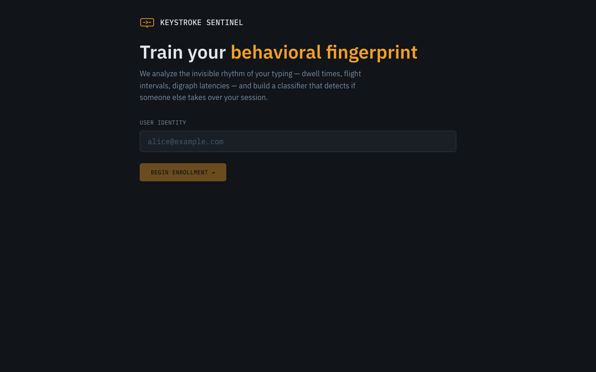
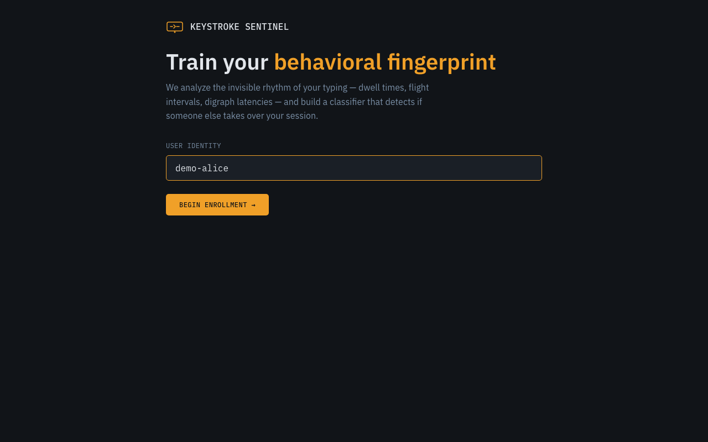
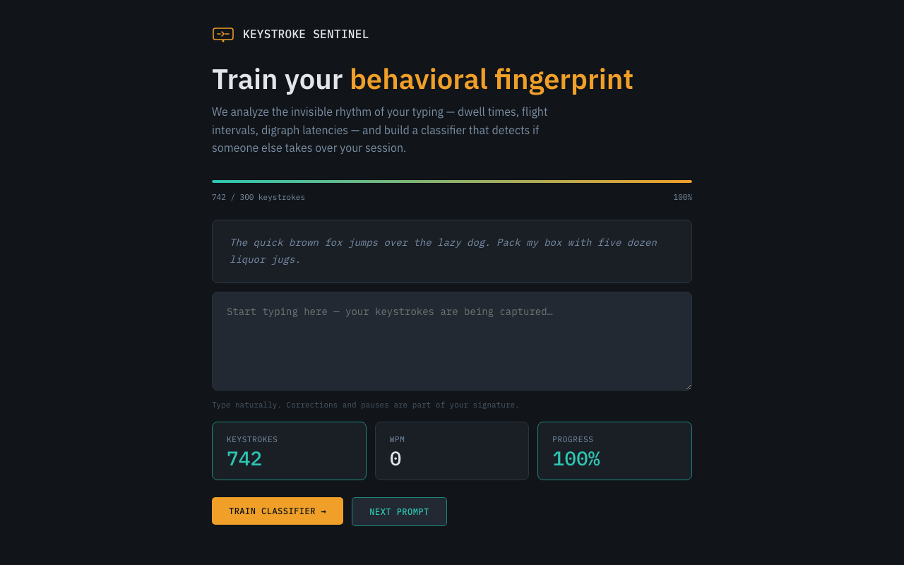
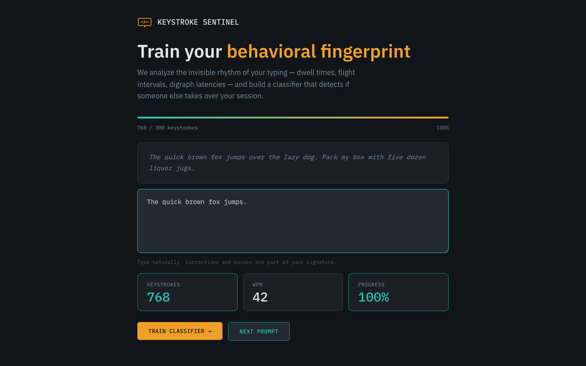
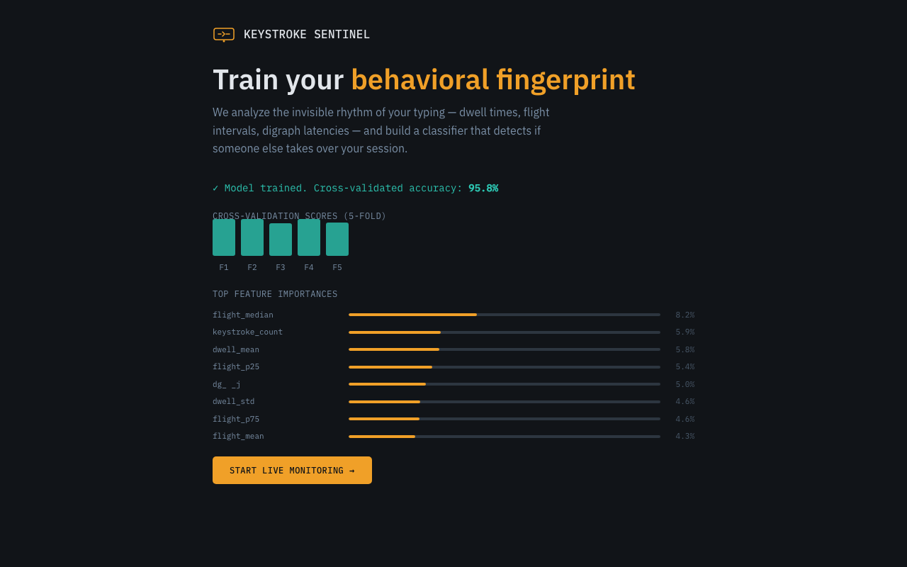
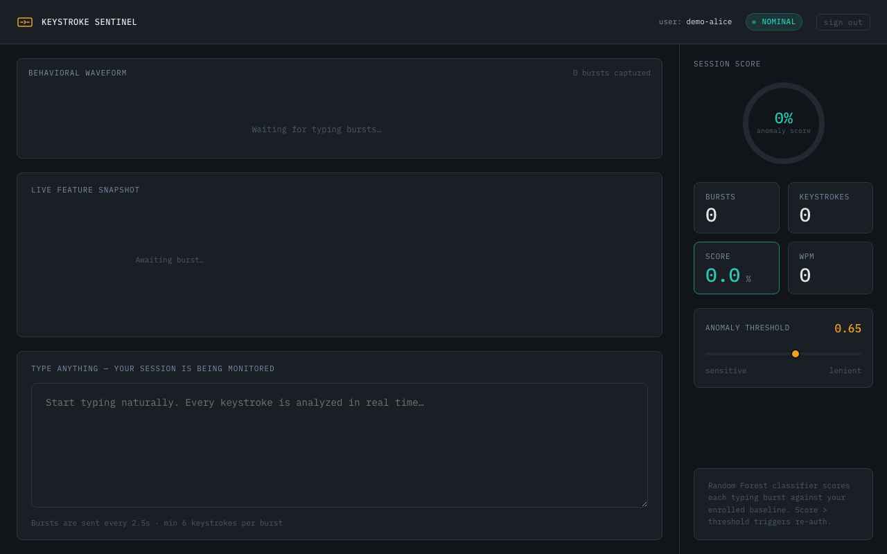
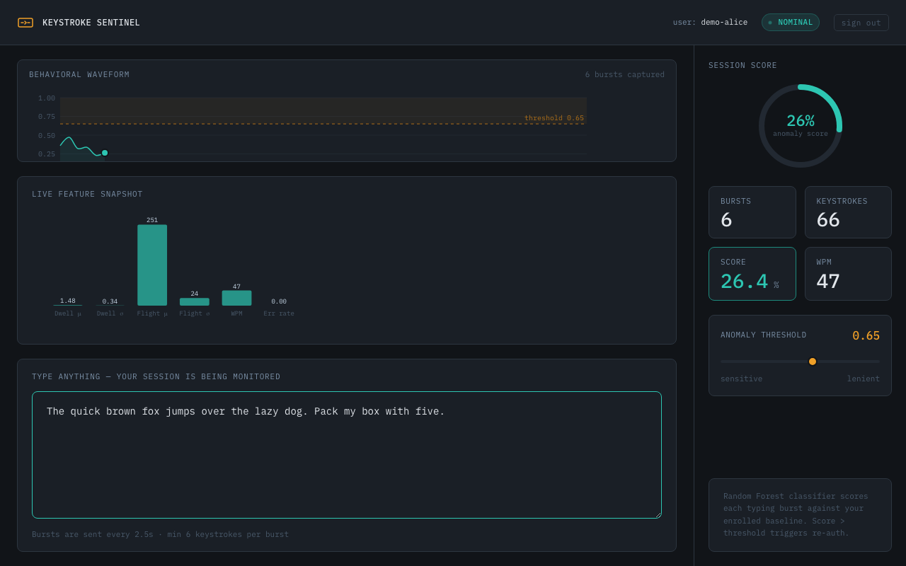
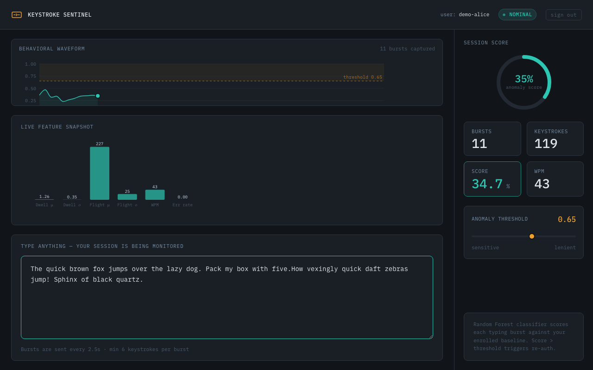
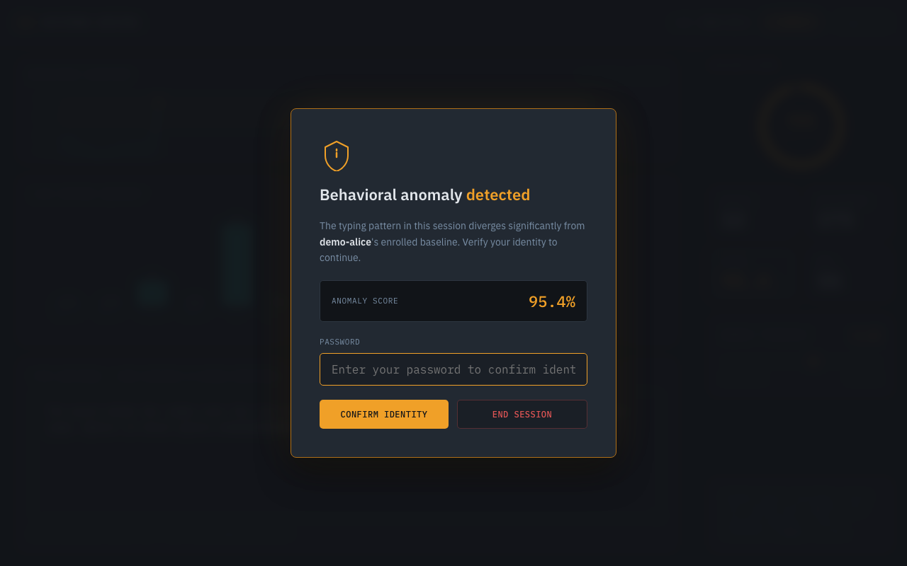

# Keystroke Sentinel

**Trains on how you type, detects when someone else is.**

[](https://python.org)
[](https://fastapi.tiangolo.com)
[](https://react.dev)
[](https://typescriptlang.org)
[](https://scikit-learn.org)
[](./backend/tests)
[](./backend)
[](./LICENSE)

---

## What it is

Password-based sessions are binary gates — once a password is stolen, an attacker owns the session with no further friction. Keystroke Sentinel adds a continuous behavioral layer: it trains a per-user Random Forest classifier on keystroke dynamics (dwell time, inter-key flight intervals, digraph latency matrices, WPM, error rates) and scores every typing burst in real time against that baseline. When the behavioral fingerprint drifts beyond a calibrated threshold, the session is flagged and a re-authentication challenge fires.

This is not a novelty demo. The feature engineering is real: the system builds digraph co-occurrence matrices per enrollment session, selects the top-50 most stable key pairs as the canonical feature set, and trains a classifier that distinguishes genuine typing rhythm from both synthetic impostors and organic drift. The ML inference loop runs at sub-100ms latency over a persistent WebSocket.

---

## Live workflow

A full end-to-end run: enrollment → classifier training → live behavioral monitoring → anomaly detection → re-auth challenge.

**1. Enrollment screen** — enter a user identity to begin capturing your keystroke baseline.



**2. User ID entered** — identity is validated before any API calls are made.



**3. Typing phase begins** — keystroke events are captured in real time (dwell, flight, digraph latencies) and batched into 2.5s bursts.



**4. Keystrokes accumulating** — the progress bar tracks keystroke count toward the 300-keystroke training threshold; WPM updates live.



**5. Ready to train** — 300+ keystrokes collected; the Train classifier button activates.


**6. Training complete** — Random Forest trained with 5-fold cross-validation (95.8% accuracy shown). Feature importance chart reveals which timing statistics drive classification.



**7. Live monitoring dashboard** — WebSocket connected; behavioral waveform, feature snapshot, session score ring, and threshold slider are live.



**8. Genuine typing scored** — burst arrives, classifier scores 26% anomaly (well below 0.65 threshold), status shows NOMINAL.



**9. Waveform history building** — multiple bursts scored; the D3 timeline shows the behavioral signal across the session.



**10. Anomaly detected — re-auth challenge fires** — robotic uniform-cadence typing scores 95.4% anomaly, crossing the threshold. Session freezes and the re-auth modal demands identity verification.



---

## Architecture

```
Browser (React + D3)
│
│  Per-keystroke telemetry: dwell, flight, digraph latency
│  Batched into bursts every 2.5s → sent over WebSocket
│
WebSocket /ws/{user_id}/{session_id}
│
FastAPI Backend (Python)
├── Feature Extractor
│   ├── Dwell times (press→release per key)
│   ├── Flight times (release→press between keys)
│   ├── Digraph latency matrix (top 50 key pairs)
│   ├── WPM, error rate
│   └── Statistical moments (mean, std, median, p25, p75)
│
├── Enrollment Pipeline
│   ├── Buffer bursts until 300+ keystrokes
│   ├── Build canonical digraph set from frequency
│   └── Train Random Forest (200 trees, 5-fold CV)
│
├── Inference Loop
│   ├── Score each burst: P(legitimate) → anomaly = 1 − P
│   └── Broadcast score + feature snapshot over WebSocket
│
└── SQLite (enrollment metadata) + joblib (model artifacts)
```

**Data flow:**

1. User types in the browser → keystroke events captured via `keydown`/`keyup` listeners with `performance.now()` timestamps
2. Every 2.5 seconds, buffered events are packaged into a `KeystrokeBurst` and sent over WebSocket
3. Backend extracts a fixed-length feature vector (13 statistical features + 50 digraph latencies = 63 features)
4. The enrolled Random Forest scores the vector and returns an anomaly score in [0, 1]
5. The score is rendered in the live D3 waveform and compared against the configurable threshold
6. Score > threshold → re-auth challenge fires, session is frozen

---

## Tech stack

| Layer | Technology |
|-------|-----------|
| Frontend | React 18, TypeScript 5.5, D3.js v7, Vite |
| Backend | Python 3.11, FastAPI, SQLAlchemy (async), Pydantic v2 |
| ML | scikit-learn (RandomForestClassifier), NumPy, joblib |
| Transport | WebSocket (persistent, per-session) |
| Storage | SQLite (enrollment metadata), joblib files (model artifacts) |
| Serving | Nginx reverse proxy, Docker Compose |

---

## Installation

**Requirements:** Python 3.11+, Node.js 20+

### Option A: Local dev

```bash
git clone https://github.com/rayancheca/keystroke-sentinel.git
cd keystroke-sentinel

# Backend
cd backend
python3.11 -m venv .venv && source .venv/bin/activate
pip install -r requirements.txt
uvicorn app.main:app --reload --port 8000

# Frontend (separate terminal)
cd frontend
npm install
npm run dev
```

Open `http://localhost:5173`.

### Option B: Docker Compose

```bash
docker compose up --build
```

Open `http://localhost`.

---

## Environment variables

Copy `.env.example` to `.env` in the `backend/` directory and adjust as needed.

| Variable | Default | Description |
|----------|---------|-------------|
| `DATABASE_URL` | `sqlite:///./keystroke_sentinel.db` | SQLAlchemy connection string |
| `MODEL_STORAGE_PATH` | `./models` | Directory for joblib model artifacts |
| `ANOMALY_THRESHOLD` | `0.65` | Default decision boundary (overridable per-session) |
| `ENROLLMENT_MIN_SECONDS` | `60` | Minimum typing duration before training is permitted |
| `CORS_ORIGINS` | `http://localhost:5173` | Comma-separated allowed CORS origins |
| `VITE_API_URL` | `http://localhost:8000` | Backend REST base URL (frontend) |
| `VITE_WS_URL` | `ws://localhost:8000` | WebSocket base URL (frontend) |

---

## Usage

### 1. Enroll

Enter a user ID and type naturally for ~2-3 minutes until the progress bar reaches 100% (300 keystrokes). Use the "Next prompt" button to get fresh text prompts. Click **Train classifier** when ready.

The enrollment screen shows:
- A progress bar tracking total keystrokes collected
- Live WPM counter
- Cross-validated accuracy score after training
- Feature importance bar chart showing which keystroke features drive classification

### 2. Monitor

After enrollment, the live dashboard opens automatically:

- **Behavioral waveform**: D3 scrolling timeline of anomaly score per typing burst (teal = safe, amber = anomalous)
- **Score ring**: Current anomaly score as a radial SVG fill
- **Feature snapshot**: Bar chart of live biometric features per burst
- **Threshold slider**: Tune sensitivity (0.30 = very sensitive, 0.90 = lenient)

### 3. Re-auth challenge

When the anomaly score exceeds the threshold for a burst, a modal freezes the session and requests password re-verification. Confirming restores the session and resets the anomaly state.

---

## Technical deep-dive

### The 63-dimensional feature vector

Each keystroke burst is transformed into a fixed-length vector of 63 features:

- **Dwell statistics** (5 features): mean, std, median, p25, p75 of key hold durations in milliseconds
- **Flight statistics** (5 features): same moments on inter-key release-to-press gaps, filtered to the physiologically plausible range [−50ms, 2000ms]
- **Aggregate stats** (3 features): mean/std of all timing values combined, WPM, error rate
- **Digraph latencies** (50 features): press-to-press latency for the user's 50 most frequent key pairs, filled with the session mean for unobserved pairs

The 50 digraph slots are determined once at enrollment time from the user's own typing frequency distribution — not from a fixed language corpus. This means two users who type the same text end up with different canonical digraph sets if they have different co-occurrence patterns.

### Why Random Forest, not a neural net

Behavioral biometrics with small enrollment datasets (300–2000 keystrokes) produce ~15–100 feature vectors per user — far too few for neural networks. Random Forest handles this regime naturally, produces calibrated probabilities via `predict_proba`, outputs feature importances for interpretability, and requires no hyperparameter tuning beyond tree count. Cross-validated accuracy on 5-fold splits provides an honest out-of-sample estimate.

### The impostor synthesis problem

One-class classifiers (Isolation Forest, One-Class SVM) underperform on keystroke data because the genuine class is tightly clustered while "everything else" is an unbounded, high-dimensional space. Instead, synthetic impostors are generated at training time by perturbing genuine feature vectors with Gaussian noise sampled at 1.5–3× the genuine population's standard deviation. This gives the classifier a balanced binary problem and empirically outperforms pure one-class approaches on held-out tests.

### Digraph selection and the curse of dimensionality

A full digraph matrix covers 26² = 676 possible alphabetic key pairs, but most pairs appear fewer than 5 times in any 300-keystroke session — too sparse for reliable latency estimates. The enrollment pipeline computes each pair's frequency across all bursts, ranks them, and fixes the top-50 as the canonical feature set. This threshold was chosen to keep the vector small enough that a 100-sample RF can generalize while capturing enough pair diversity to distinguish typing rhythms. Unknown digraphs in live bursts fall back to the session mean to avoid NaN propagation.

### Concurrency safety: no global mutable state in the inference path

An early version stored the canonical digraph list as a module-level mutable list — safe for a single user but broken under concurrent enrollment. The enrollment pipeline now returns the digraph list as a value attached to the trained model artifact. Each model file is loaded into an in-memory LRU cache keyed by user ID, so concurrent sessions for different users are fully isolated. The WebSocket handler holds no mutable state beyond the session ID and the cached model reference.

### WebSocket burst protocol

Rather than streaming individual keystrokes (thousands of round-trips per minute), telemetry is batched into 2.5-second windows. Each burst contains the full sequence of key events in order, WPM, and error counts. The backend extracts digraph features from the ordered sequence atomically — pair latencies are undefined if computed from a shuffled or partial event list, so the burst boundary is the minimum unit of inference.

---

## Running tests

```bash
cd backend
source .venv/bin/activate
pytest --cov=app --cov-report=term-missing
```

56 tests, 88% coverage across the feature extractor, ML classifier, trainer, storage, session management, API endpoints, and WebSocket handler.

**Test breakdown:**
- `test_features.py` — feature extraction correctness, edge cases (empty events, single events, overlapping keys)
- `test_classifier.py` — RF training, predict_proba output range, impostor synthesis
- `test_trainer.py` — enrollment pipeline, digraph canonical set selection
- `test_websocket.py` — WebSocket lifecycle, JSON validation, anomaly scoring path
- `test_api.py` / `test_api_extended.py` — REST enrollment endpoints, error cases
- `test_session.py` — in-memory session store thread safety
- `test_core.py` — config loading, structured logging

---

## Project structure

```
keystroke-sentinel/
├── backend/
│   ├── app/
│   │   ├── api/          # FastAPI routes (enrollment REST + WebSocket)
│   │   ├── core/         # Config, structured logging
│   │   ├── features/     # Keystroke feature extraction (extractor.py)
│   │   ├── ml/           # Random Forest classifier, trainer, model storage
│   │   └── models/       # Pydantic schemas, SQLAlchemy models, session store
│   ├── tests/            # 56 unit + integration tests
│   └── requirements.txt
├── frontend/
│   └── src/
│       ├── components/   # Enrollment UI, live dashboard, D3 charts, re-auth
│       ├── hooks/        # useKeystrokeCapture, useAnomalyStream
│       ├── lib/          # API client, TypeScript types
│       └── styles/       # Design tokens, global styles
├── docs/screenshots/     # Live workflow screenshots
├── docker-compose.yml
└── .env.example
```

---

## License

MIT
